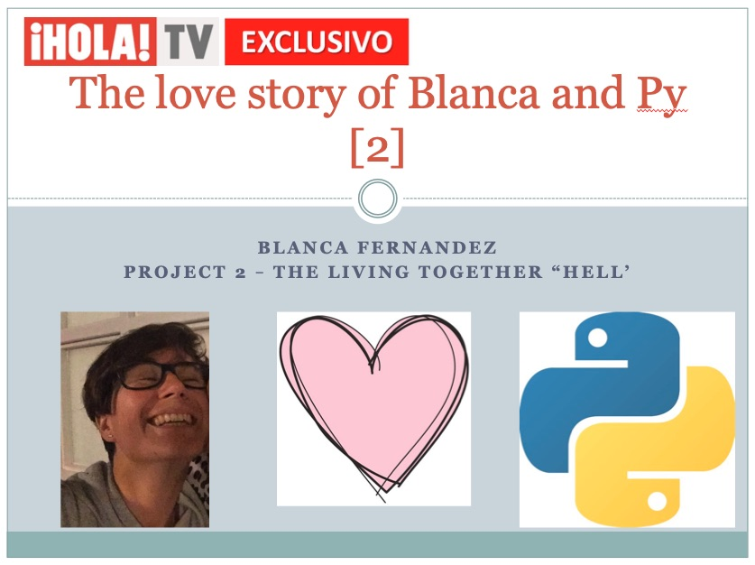
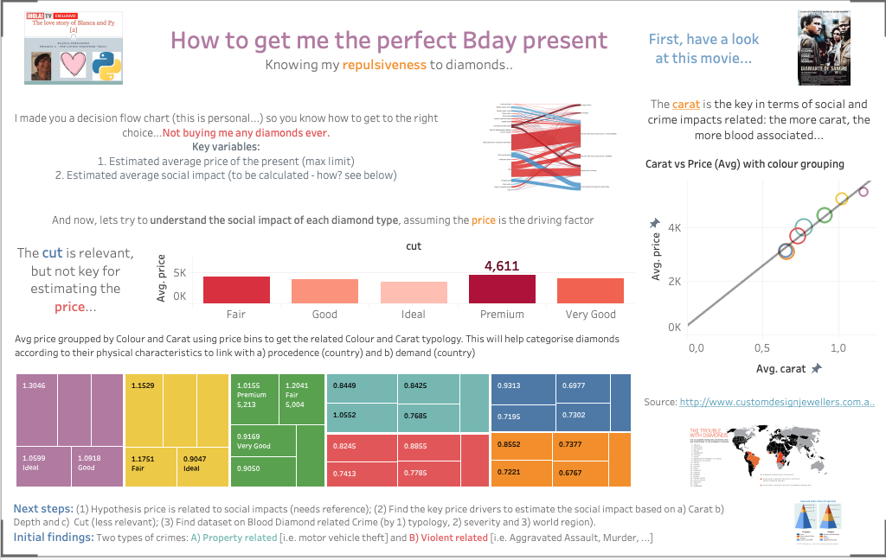

# **ih_datamadpt0420_project_m2**

## **Data:**

Dataset can be downloaded [here](http://www.potacho.com/files/ironhack/diamonds_train.csv). 
Also available: /data/diamonds_train.csv

---

## **Deliverables:**

A GitHub repository, preferably named: **ih_datamadpt0420_project_m2**, including:

- `data_analysis_report.ipynb` file that holds the results of challenge 1. You may add to the `notebooks/` folder any work/draft notebooks, data or files used to build your report.

- `README.md` file explaining the job done, your main conclusions and the **link** to your Tableau Public dashboard. You may find more info of how to build a README file [here](https://github.com/potacho/data-project-template/blob/master/README.md).

### **Presentation:**
- **Content:** This dashboard explains the best for getting meaningful data insights. It also supports your my arguments in the conclusions obtained from the exploratory analysis.

    :point_up: :point_up: :point_up: :point_up: :point_up: :point_up: :point_up: :point_up: :point_up: :point_up: :point_up: :point_up:

---

## **Challenge 1: Exploratory Data Visualization Charts and Summary Statistics**

The goal of this challenge is to build an **exploratory data analysis report** in order to gain initial insight on our diamonds dataset. Your notebook must include:

- Summary statistics including descriptive statistics (max, min, mean, standard deviation, percentiles, correlations, etc.) and data types (integer, float, boolean, string, etc.).
- Data visualizations charts in order to capture a large amount of data all at once in a clear and concise manner (Box Plots, Histograms, Bar Plots, Scatter Plots, Correlation Matrix, etc.).

> **IMPORTANT NOTE:** You may use the tools explained during lessons that you find more convenient in order to provide the requested output. 

### **Result: see notebook/analysis**

---
## **Challenge 2: Tableau Data Dashboard**

Dashboards are powerful tools for communicating important information **at-a-glance**. The goal of this challenge is to build a data dashboard using our diamonds dataset that will help the final user (i.e.: yourself) to perform better during Module 3 project (Kaggle Competition). 

A data dashboard is not exactly a sequential set of descriptive charts like those you have built in challenge 1. Instead, a data dashboard should be **a single interactive interface built around a specific objetive and which components are logically arranged in order to provide data relevant insights effectively**. Therefore, bear in mind the main objective of the competition: _understand the relationship between diamonds attributes (features) or group of attributes, and its price_.

### **Result: Check my Dashboard here: https://public.tableau.com/profile/blanca.fernandez#!/vizhome/BlancasDD/Story1**

---
## **Challenge 3: Hypothesis Testing**

We might want to know if our sample and sub-samples are representative of diamonds in general. Moreover, we might want to reach some conclusions about the influence of certain diamonds features in their price. In that sense, we propose you to perform two statistical tests:

Test 1 - one sample vs constant hypothesis test. We know from the available literature that diamonds average price rounds about 4000 USD. The aim is to test whether the prices in our sample are significantly different from the literature value. Give some conclusions about the implications of your test results.

Test 2 - two independent samples. Our sample includes diamonds with different features (carat, cut, color clarity, etc.). It seems clear that the carat plays an important role in price. However, it's not that clear whether the prices of some "sub-groups" are significantly different from each other. These are the "sub-groups" that you might feel suspicious about it:

    Sub-Test 1: Fair cut + color G vs. Fair cut + color I

    Sub-Test 2: Good cut + color E vs. Good cut + color F

    Sub-Test 3: Ideal cut + color D vs. Ideal cut + color E

    Sub-Test 4: Premium cut + color D vs. Premium cut + color E

    Sub-Test 5: Very Good cut + color I vs. Very Good cut + color J

    Sub-Test 6: All cuts + color D vs. All cuts + color E

Remember to also include your conclusions about the implications of your test results and all metrics involved (e.g.: samples size).

### **Result: see notebook/hypothesis_testing and key outcomes below**

Test 1: t suggests that the price might be smaller than 4000 EUR as it is -3.604902369125729
We can reject the null hypothesis as the p-value is 0.00031264532833074845 Therefore, the avg. price is significantly different from 4000 EUR. 

Test 2 [Sub-Test 5]: We reject the alternative h (the two groups have significantly different prices) as the results shows p value > 0.005 (statistic=0.34857584108266776, pvalue=0.7274714598286438)

--- 

## **References:**

- [Matplotlib](https://matplotlib.org/)

- [Pandas Visualization](https://pandas.pydata.org/pandas-docs/stable/user_guide/visualization.html)

- [Seaborn](https://seaborn.pydata.org/)

- [Tableau Public](https://public.tableau.com/)

- [Financial Times Visual Vocabulary](https://github.com/ft-interactive/chart-doctor/tree/master/visual-vocabulary)

- [Tableau Viz of the Day](https://public.tableau.com/es-es/gallery/?tab=viz-of-the-day&type=viz-of-the-day)

- [Introducing plotly express](https://medium.com/plotly/introducing-plotly-express-808df010143d)

